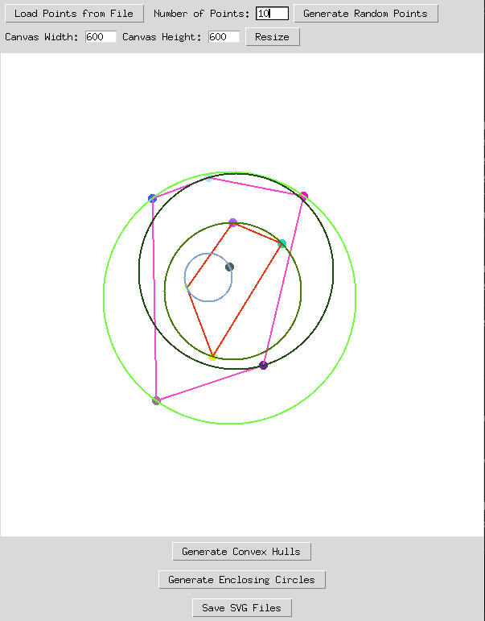

# Point Dragger and Geometry Visualizer

## Table of Contents

- [Overview](#overview)
- [How to Run](#how-to-run)
- [Features](#features)
- [Algorithms and Time Complexity](#algorithms-and-time-complexity)
- [Code Structure](#code-structure)

## Overview

This project is a Python Tkinter GUI application that allows you to:

- **Load** or **generate random points** on a canvas.
- **Drag points** interactively to change their positions.
- **Generate convex hull layers** for the set of points using the Graham scan algorithm.
- **Generate iterative minimum enclosing circles** (using a randomized MINIDISC algorithm) that enclose the remaining points.
- **Export the visualization as SVG files** in several formats, along with a summary text file:
  - **points.svg:** Contains only the input points (drawn as small black circles).
  - **hull.svg:** Overlays convex hull layers (drawn in alternating colors such as red and blue) with points colored according to the hull they belong to.
  - **cir.svg:** Overlays iterative minimum enclosing circles (drawn in alternating colors, e.g., neon-green and orange) with points colored according to the circle they are part of.
  - **all.svg:** Combines hulls, circles, and points (drawn in that order) into a single file.
  - **out.txt:** A summary text file listing the convex hull layers (from outermost to innermost) and the minimum enclosing circles (from biggest to smallest) along with the points that belong to each layer.




## How to Run

1. **Requirements:**
   - Python 3.x must be installed.
   - No external libraries are required (only standard Python libraries are used).

2. **Running the Application:**
   - Save the code as `gui.py` (or a name of your choice).
   - Open a terminal or command prompt.
   - Navigate to the project directory.
   - Run the command:
     ```bash
     python gui.py
     ```

3. **Using the Application:**
   - **Generate Points:**  
     Enter the desired number of points in the **Number of Points:** field.
     - Click **Generate Uniform Points** for uniformly distributed points.
     - Click **Generate Gaussian Points** for points with a Gaussian distribution.
     - Click **Generate Exponential Points** for points with an exponential distribution.

     Points are generated with a margin (central portion of the canvas) and are rejected if they are too close to any existing point.
   - **Load Points:**  
     Click **Load Points from File** to load points from a text file formatted as follows:
     - The first line contains the number of points.
     - Each subsequent line contains two integers (x and y coordinates) separated by a space.
   - **Resize Canvas:**  
     Adjust the canvas width and height using the input fields and click **Resize**.
   - **Visualize:**  
     - Click **Generate Convex Hulls** to compute and display convex hull layers.
     - Click **Generate Enclosing Circles** to compute and display minimum enclosing circles.
   - **Export:**  
     Click **Save SVG Files & Summary** to export the visualization to the SVG files (`points.svg`, `hull.svg`, `cir.svg`, `all.svg`) and save the summary in `out.txt`.
## Features

- **Point Generation with Distance Rejection:**  
  Points are generated such that no two points lie too close together. The minimum distance is dynamically computed based on the canvas dimensions and the number of points, with a safety factor (between 2 and 5) applied.

- **Multiple Randomness Options:**  
  Three methods of point generation are available:
  - **Uniform:** Points are generated uniformly within the central portion of the canvas.
  - **Gaussian:** Points are generated with a Gaussian distribution centered at the canvas center.
  - **Exponential:** Points are generated using an exponential distribution (shifted so that the mean is centered).

- **Interactive Dragging:**  
  Points are drawn as small colored circles. Click and drag any point to reposition it on the canvas.

- **Convex Hull Generation:**  
  The application computes convex hull layers using the Graham scan algorithm. Each hull layer is drawn in a random (or alternating) color.

- **Minimum Enclosing Circles:**  
  The application iteratively computes the minimum enclosing circle using a randomized MINIDISC algorithm. Each circle is drawn in a designated color, and when exporting, the points on a circle's boundary are colored accordingly.

- **SVG Export & Summary:**  
  The visualization can be exported into four SVG files:
  - **points.svg:** Only the input points in black.
  - **hull.svg:** Convex hull layers (alternating red and blue) with points colored by hull.
  - **cir.svg:** Minimum enclosing circles (alternating neon-green (`#AAFF00`) and orange) with points colored by circle.
  - **all.svg:** A combined view overlaying hulls, circles, and points.
  
  Additionally, a summary text file (`out.txt`) is generated, listing:
  - **Hull layers:** The points in each convex hull layer from outermost to innermost.
  - **Circles:** The points on the boundary of each minimum enclosing circle from largest to smallest.

## Algorithms and Time Complexity

### Graham Scan (Convex Hull)
- **Algorithm:**  
  The algorithm sorts the points based on their polar angle relative to the lowest point, then iteratively constructs the convex hull by checking the turn direction using cross products.
- **Time Complexity:**  
  O(n log n), dominated by the sorting step.

### MINIDISC (Minimum Enclosing Circle)
- **Algorithm:**  
  The randomized incremental MINIDISC algorithm processes points in random order. When a point is found outside the current circle, helper functions `MINIDISCWITHPOINT` and `MINIDISCWITH2POINTS` update the circle to include that point while maintaining the minimality condition.
- **Expected Time Complexity:**  
  Expected O(n) (although the worst-case time can be higher).

## Code Structure

- **Geometry Class:**  
  Provides static methods for geometric computations, including:
  - Convex hull computation (Graham scan).
  - Minimum enclosing circle computation (MINIDISC and helper functions).
  - Utility functions to check if a point is inside or on the boundary of a circle.

- **PointDragger Class:**  
  Manages the GUI, including:
  - **Point Management:** Loading, generating, dragging, and resizing points.
  - **Visualization:** Drawing convex hull layers and minimum enclosing circles.
  - **Exporting:** Saving the visualization as multiple SVG files and a summary text file via helper functions.
